# Product Archetype

Implementacja wzorca **Product Archetype** w TypeScript — uniwersalny model domenowy dla produktów, niezależny od branży.

Przetłumaczono z referencyjnej implementacji w Javie: [Archetypy-Oprogramowania/archetypes](https://github.com/Archetypy-Oprogramowania/archetypes/tree/main/product).

## Spis treści

- [Czym jest Product Archetype?](#czym-jest-product-archetype)
- [Diagram klas (ERD)](#diagram-klas-erd)
- [Struktura katalogów](#struktura-katalogów)
- [Szybki start](#szybki-start)
- [Kluczowe koncepty](#kluczowe-koncepty)
- [Przykłady użycia](#przykłady-użycia)
- [Wzorce projektowe](#wzorce-projektowe)
- [Testy](#testy)

## Czym jest Product Archetype?

Product Archetype to **powtarzalny wzorzec domenowy**, który modeluje pojęcie "produktu" w sposób uniwersalny. Niezależnie od branży — retail, telekomunikacja, bankowość, ubezpieczenia — każdy biznes sprzedaje *coś*. Ten archetyp wychwytuje esencjonalną strukturę, którą dzielą WSZYSTKIE produkty.

**Trzy poziomy abstrakcji:**

| Poziom | Klasa | Opis | Przykład |
|--------|-------|------|----------|
| **Typ** | `ProductType` / `PackageType` | CO to jest (definicja) | "iPhone 15 Pro 256GB" |
| **Oferta** | `CatalogEntry` | Że jest NA SPRZEDAŻ | "iPhone 15 Pro — Najbardziej zaawansowany iPhone!" |
| **Instancja** | `ProductInstance` / `PackageInstance` | CO ZOSTAŁO DOSTARCZONE | Konkretny telefon z numerem seryjnym ABC123 |

## Diagram klas (ERD)

```mermaid
classDiagram
    direction TB

    %% ━━━ Core Domain (Composite Pattern) ━━━

    class Product {
        <<interface>>
        +id: ProductIdentifier
        +name: ProductName
        +description: ProductDescription
        +metadata: ProductMetadata
        +applicabilityConstraint: ApplicabilityConstraint
    }

    class ProductType {
        +preferredUnit: Unit
        +trackingStrategy: ProductTrackingStrategy
        +featureTypes: ProductFeatureTypes
        +define()$ ProductType
        +unique()$ ProductType
        +individuallyTracked()$ ProductType
        +batchTracked()$ ProductType
        +identical()$ ProductType
    }

    class PackageType {
        +structure: PackageStructure
        +validateSelection() PackageValidationResult
    }

    Product <|.. ProductType : implements
    Product <|.. PackageType : implements

    %% ━━━ Value Objects ━━━

    class ProductIdentifier {
        <<discriminated union>>
        UUID | ISBN | GTIN
        +idType: string
        +value: string
    }

    class ProductName {
        +value: string
    }

    class ProductDescription {
        +value: string
    }

    class ProductMetadata {
        -data: Map~string, string~
        +get(key) string
        +with(key, value) ProductMetadata
        +asRecord() Record
    }

    class Validity {
        +from: string?
        +to: string?
        +isValidAt(date) boolean
        +fromDate()$ Validity
        +until()$ Validity
        +between()$ Validity
        +always()$ Validity
    }

    class Unit {
        +symbol: string
        +name: string
        +pieces()$ Unit
        +kilograms()$ Unit
        +meters()$ Unit
        +liters()$ Unit
    }

    class Quantity {
        +amount: number
        +unit: Unit
    }

    Product --> ProductIdentifier : id
    Product --> ProductName : name
    Product --> ProductDescription : description
    Product --> ProductMetadata : metadata
    ProductType --> Unit : preferredUnit
    Quantity --> Unit : unit

    %% ━━━ Tracking Strategy ━━━

    class ProductTrackingStrategy {
        <<enum>>
        UNIQUE
        INDIVIDUALLY_TRACKED
        BATCH_TRACKED
        INDIVIDUALLY_AND_BATCH_TRACKED
        IDENTICAL
    }

    ProductType --> ProductTrackingStrategy : trackingStrategy

    %% ━━━ Feature System ━━━

    class ProductFeatureType {
        +name: string
        +constraint: FeatureValueConstraint
        +isValidValue(value) boolean
        +validateValue(value) void
        +withAllowedValues()$ ProductFeatureType
        +withNumericRange()$ ProductFeatureType
        +withDecimalRange()$ ProductFeatureType
        +withRegex()$ ProductFeatureType
        +withDateRange()$ ProductFeatureType
        +unconstrained()$ ProductFeatureType
    }

    class FeatureValueConstraint {
        <<interface>>
        +valueType: FeatureValueType
        +constraintType: string
        +isValid(value) boolean
        +desc() string
    }

    class AllowedValuesConstraint {
        +allowedValues: Set~string~
    }
    class NumericRangeConstraint {
        +min: number
        +max: number
    }
    class DecimalRangeConstraint {
        +min: number
        +max: number
    }
    class DateRangeConstraint {
        +from: string
        +to: string
    }
    class RegexConstraint {
        +pattern: RegExp
    }
    class UnconstrainedConstraint {
    }

    FeatureValueConstraint <|.. AllowedValuesConstraint
    FeatureValueConstraint <|.. NumericRangeConstraint
    FeatureValueConstraint <|.. DecimalRangeConstraint
    FeatureValueConstraint <|.. DateRangeConstraint
    FeatureValueConstraint <|.. RegexConstraint
    FeatureValueConstraint <|.. UnconstrainedConstraint

    ProductFeatureType --> FeatureValueConstraint : constraint

    class ProductFeatureTypes {
        +mandatoryFeatures() ProductFeatureType[]
        +optionalFeatures() ProductFeatureType[]
        +has(name) boolean
        +isMandatory(name) boolean
    }

    class ProductFeatureInstance {
        +featureType: ProductFeatureType
        +value: unknown
        +asString() string
        +asInt() number
        +asDecimal() number
        +asDate() string
        +asBoolean() boolean
    }

    ProductType --> ProductFeatureTypes : featureTypes
    ProductFeatureTypes --> "*" ProductFeatureType : contains
    ProductFeatureInstance --> ProductFeatureType : featureType

    %% ━━━ Constraints (Specification Pattern) ━━━

    class ApplicabilityConstraint {
        <<discriminated union>>
        alwaysTrue | equals | in
        greaterThan | lessThan | between
        and | or | not
    }

    Product --> ApplicabilityConstraint : applicabilityConstraint

    %% ━━━ Package Structure (Selection) ━━━

    class PackageStructure {
        +productSets: Map~string, ProductSet~
        +selectionRules: SelectionRule[]
        +validate(selection) PackageValidationResult
    }

    class ProductSet {
        +name: string
        +products: ProductIdentifier[]
        +contains(id) boolean
    }

    class SelectionRule {
        <<discriminated union>>
        isSubsetOf | and | or | not | conditional
    }

    class SelectedProduct {
        +productId: ProductIdentifier
        +quantity: number
    }

    PackageType --> PackageStructure : structure
    PackageStructure --> "*" ProductSet : productSets
    PackageStructure --> "*" SelectionRule : selectionRules
    ProductSet --> "*" ProductIdentifier : products

    %% ━━━ Instances ━━━

    class Instance {
        <<interface>>
        +id: InstanceId
        +product: Product
        +serialNumber: SerialNumber?
        +batchId: BatchId?
    }

    class ProductInstance {
        +productType: ProductType
        +quantity: Quantity?
        +features: ProductFeatureInstances
    }

    class PackageInstance {
        +packageType: PackageType
        +selection: SelectedInstance[]
    }

    class SelectedInstance {
        +instance: Instance
        +quantity: number
        +toSelectedProduct() SelectedProduct
    }

    Instance <|.. ProductInstance : implements
    Instance <|.. PackageInstance : implements
    ProductInstance --> ProductType : productType
    ProductInstance --> "*" ProductFeatureInstance : features
    PackageInstance --> PackageType : packageType
    PackageInstance --> "*" SelectedInstance : selection
    SelectedInstance --> Instance : instance

    class SerialNumber {
        <<discriminated union>>
        TEXTUAL | IMEI | VIN
        +value: string
    }

    class InstanceId {
        +value: string
    }

    class BatchId {
        +value: string
    }

    Instance --> SerialNumber : serialNumber
    Instance --> InstanceId : id
    Instance --> BatchId : batchId

    %% ━━━ Catalog ━━━

    class CatalogEntry {
        +id: CatalogEntryId
        +displayName: string
        +description: string
        +product: Product
        +categories: Set~string~
        +validity: Validity
        +metadata: Record
        +isAvailableAt(date) boolean
        +isInCategory(cat) boolean
        +withValidity(v) CatalogEntry
        +withMetadata(m) CatalogEntry
    }

    CatalogEntry --> Product : product
    CatalogEntry --> Validity : validity

    %% ━━━ Relationships ━━━

    class ProductRelationship {
        <<interface>>
        +id: ProductRelationshipId
        +from: ProductIdentifier
        +to: ProductIdentifier
        +type: ProductRelationshipType
    }

    class ProductRelationshipType {
        <<enum>>
        UPGRADABLE_TO
        SUBSTITUTED_BY
        REPLACED_BY
        COMPLEMENTED_BY
        COMPATIBLE_WITH
        INCOMPATIBLE_WITH
    }

    ProductRelationship --> ProductRelationshipType : type
    ProductRelationship --> ProductIdentifier : from
    ProductRelationship --> ProductIdentifier : to

    %% ━━━ Repositories ━━━

    class ProductTypeRepository {
        <<interface>>
        +save(productType)
        +findById(id) ProductType?
        +findAll() ProductType[]
        +findByTrackingStrategy(s) ProductType[]
    }

    class CatalogEntryRepository {
        <<interface>>
        +save(entry)
        +findById(id) CatalogEntry?
        +findAll() CatalogEntry[]
        +findByCategory(cat) CatalogEntry[]
    }

    class ProductRelationshipRepository {
        <<interface>>
        +save(rel)
        +findAllRelationsFrom(id) ProductRelationship[]
        +delete(id)
    }

    ProductTypeRepository --> ProductType : manages
    CatalogEntryRepository --> CatalogEntry : manages
    ProductRelationshipRepository --> ProductRelationship : manages

    %% ━━━ Facades (Application Services) ━━━

    class ProductFacade {
        +handleDefineProductType(cmd) Result
        +findByProductId(q) ProductTypeView?
        +findByTrackingStrategy(q) ProductTypeView[]
    }

    class ProductCatalog {
        +handleAddToOffer(cmd) Result
        +handleDiscontinue(cmd) Result
        +handleUpdateMetadata(cmd) Result
        +search(criteria) CatalogEntryView[]
    }

    class ProductRelationshipsFacade {
        +handleDefineRelationship(cmd) Result
        +handleRemoveRelationship(cmd) Result
        +findAllRelationsFrom(id) ProductRelationship[]
    }

    class ProductConfiguration {
        +productFacade: ProductFacade
        +productCatalog: ProductCatalog
        +productRelationshipsFacade: ProductRelationshipsFacade
        +inMemory()$ ProductConfiguration
    }

    ProductFacade --> ProductTypeRepository : uses
    ProductCatalog --> CatalogEntryRepository : uses
    ProductCatalog --> ProductTypeRepository : uses
    ProductRelationshipsFacade --> ProductRelationshipRepository : uses
    ProductRelationshipsFacade --> ProductTypeRepository : uses
    ProductConfiguration --> ProductFacade : wires
    ProductConfiguration --> ProductCatalog : wires
    ProductConfiguration --> ProductRelationshipsFacade : wires

    %% ━━━ Builders ━━━

    class ProductBuilder {
        +asProductType(unit, strategy) ProductTypeBuilder
        +asPackageType() PackageTypeBuilder
        +withMetadata(key, value) ProductBuilder
        +withApplicabilityConstraint(c) ProductBuilder
    }

    class InstanceBuilder {
        +withSerial(sn) InstanceBuilder
        +withBatch(bid) InstanceBuilder
        +asProductInstance(pt) ProductInstanceBuilder
        +asPackageInstance(pkt) PackageInstanceBuilder
    }

    ProductBuilder ..> ProductType : creates
    ProductBuilder ..> PackageType : creates
    InstanceBuilder ..> ProductInstance : creates
    InstanceBuilder ..> PackageInstance : creates
```



## Struktura katalogów

```
src/product/
├── shared/              # Narzędzia przekrojowe
│   ├── preconditions.ts # checkArgument() + IllegalArgumentError
│   └── result.ts        # Result<E,T> (Success | Failure)
│
├── value-objects/       # Niemutowalne typy wartości
│   ├── product-identifier.ts   # UUID | ISBN | GTIN (z walidacją)
│   ├── product-name.ts         # Opakowany niepusty string
│   ├── product-description.ts  # Opakowany niepusty string
│   ├── product-metadata.ts     # Niemutowalna mapa klucz-wartość
│   ├── validity.ts             # Zakres dat (od, do, zawsze)
│   ├── quantity.ts             # Ilość + jednostka (szt, kg, m, L)
│   └── product-tracking-strategy.ts  # Strategia śledzenia instancji
│
├── features/            # System cech produktu
│   ├── feature-value-type.ts        # TEXT | INTEGER | DECIMAL | DATE | BOOLEAN
│   ├── feature-value-constraint.ts  # Ograniczenia wartości (enum, zakres, regex)
│   ├── product-feature-type.ts      # Definicja cechy (nazwa + ograniczenie)
│   └── product-feature-instance.ts  # Konkretna wartość cechy
│
├── constraints/         # Warunki stosowalności (Specification Pattern)
│   └── applicability-constraint.ts  # equals | in | gt | lt | and | or | not
│
├── selection/           # Reguły wyboru w pakietach
│   └── selection-rule.ts  # isSubsetOf | single | optional | required | ifThen
│
├── domain/              # Rdzeń domeny (Composite Pattern)
│   ├── product.ts         # Interfejs Product
│   ├── product-type.ts    # ProductType (liść — pojedynczy produkt)
│   ├── package-type.ts    # PackageType (kompozyt — pakiet produktów)
│   └── product-builder.ts # Fluent builder dla ProductType/PackageType
│
├── instances/           # Konkretne egzemplarze produktów
│   ├── serial-number.ts     # Textual | IMEI (Luhn) | VIN
│   ├── instance.ts          # InstanceId, BatchId, interfejs Instance
│   ├── product-instance.ts  # Instancja ProductType
│   ├── package-instance.ts  # Instancja PackageType + SelectedInstance
│   └── instance-builder.ts  # Fluent builder dla instancji
│
├── catalog/             # Katalog handlowy
│   └── catalog-entry.ts # Pozycja w ofercie (nazwa marketingowa, kategorie, ważność)
│
├── relationships/       # Relacje między produktami
│   └── product-relationship.ts # UPGRADABLE_TO | SUBSTITUTED_BY | COMPATIBLE_WITH | ...
│
├── repositories/        # Abstrakcje dostępu do danych
│   └── repositories.ts  # Interfejsy + implementacje in-memory
│
├── cqrs/                # Publiczne API (Command Query Responsibility Segregation)
│   ├── commands.ts      # DefineProductType, AddToOffer, DiscontinueProduct, ...
│   ├── queries.ts       # FindProductTypeCriteria, SearchCatalogCriteria, ...
│   └── views.ts         # ProductTypeView, CatalogEntryView (DTOs)
│
└── facades/             # Serwisy aplikacyjne (punkty wejścia)
    ├── product-facade.ts              # Zarządzanie definicjami produktów
    ├── product-catalog.ts             # Zarządzanie ofertą handlową
    ├── product-relationships-facade.ts # Zarządzanie relacjami
    └── product-configuration.ts       # Fabryka — łączy wszystkie komponenty
```

## Szybki start

### Instalacja

```bash
pnpm install
```

### Uruchomienie

```bash
pnpm build          # Kompilacja TypeScript → JavaScript
pnpm dev            # Live watch mode (tsx)
pnpm test           # Uruchomienie testów
pnpm test:watch     # Testy w trybie watch
```

### Minimalny przykład

```typescript
import { ProductConfiguration } from "./product/facades/product-configuration";
import { Result } from "./product/shared/result";

// 1. Stwórz w pełni połączoną konfigurację (in-memory)
const config = ProductConfiguration.inMemory();

// 2. Zdefiniuj produkt
const result = config.productFacade.handleDefineProductType({
  productIdType: "UUID",
  productId: "iphone-15-pro",
  name: "iPhone 15 Pro",
  description: "Flagowy smartfon Apple",
  unit: "pcs",
  trackingStrategy: "INDIVIDUALLY_TRACKED",
  mandatoryFeatures: [
    {
      name: "color",
      constraint: {
        kind: "allowedValues",
        allowedValues: new Set(["Natural Titanium", "Blue", "White", "Black"]),
      },
    },
    {
      name: "storage",
      constraint: {
        kind: "allowedValues",
        allowedValues: new Set(["128GB", "256GB", "512GB", "1TB"]),
      },
    },
  ],
});

if (Result.isSuccess(result)) {
  console.log("Produkt zdefiniowany:", Result.getOrThrow(result).value);
}

// 3. Dodaj do oferty handlowej
config.productCatalog.handleAddToOffer({
  productTypeId: "iphone-15-pro",
  displayName: "iPhone 15 Pro — Tytan w Twoich rękach!",
  description: "Najlepszy iPhone w historii",
  categories: new Set(["smartphones", "apple", "premium"]),
  availableFrom: "2024-09-22",
  metadata: { promoCode: "IPHONE15" },
});

// 4. Wyszukaj w katalogu
const results = config.productCatalog.search({
  categories: new Set(["smartphones"]),
  availableAt: "2024-10-15",
});
console.log("Znaleziono:", results.length, "produktów");
```

## Kluczowe koncepty

### ProductType vs PackageType (Composite Pattern)

**ProductType** — pojedynczy produkt (liść):
```typescript
// Prosty produkt — identyczne egzemplarze, brak śledzenia
const rice = ProductType.identical(id, name, desc, Unit.kilograms());

// Produkt z numerem seryjnym — każdy egzemplarz unikalny
const phone = ProductType.individuallyTracked(id, name, desc, Unit.pieces());
```

**PackageType** — pakiet produktów (kompozyt):
```typescript
const bundle = new ProductBuilder(id, name, desc)
  .asPackageType()
  .withSingleChoice("Laptop", laptopA, laptopB)         // dokładnie 1
  .withOptionalChoice("Etui", caseA, caseB)              // 0 lub 1
  .withRequiredChoice("Akcesoria", mouseA, mouseB, pad)  // co najmniej 1
  .build();
```

### Strategia śledzenia (Tracking Strategy)

| Strategia | Numer seryjny | Batch ID | Przykład |
|-----------|:---:|:---:|----------|
| `UNIQUE` | wymagany | - | Obraz Picassa |
| `INDIVIDUALLY_TRACKED` | wymagany | - | iPhone, umowa kredytowa |
| `BATCH_TRACKED` | - | wymagany | Mleko, leki |
| `INDIVIDUALLY_AND_BATCH_TRACKED` | wymagany | wymagany | Telewizory (serial + batch dla recall) |
| `IDENTICAL` | - | - | Śruby, ryż, mąka |

### System cech (Feature System)

Cechy pozwalają konfigurować produkty **bez tworzenia podklas**:

```typescript
// Zamiast: iPhoneRed, iPhoneBlue, iPhoneSilver...
// Definiujesz:
const color = ProductFeatureType.withAllowedValues("color", "red", "blue", "silver");
const weight = ProductFeatureType.withDecimalRange("weight", "0.1", "2.0");
const year = ProductFeatureType.withNumericRange("year", 2020, 2025);
const code = ProductFeatureType.withRegex("code", "^[A-Z]{2}-\\d{4}$");
const expiry = ProductFeatureType.withDateRange("expiry", "2024-01-01", "2025-12-31");

// I przypisujesz wartości przy tworzeniu instancji:
const instance = new InstanceBuilder(InstanceId.newOne())
  .withSerial(SerialNumber.of("SN-001"))
  .asProductInstance(phoneType)
  .withFeature(color, "silver")
  .withFeature(weight, 0.206)
  .build();
```

### Warunki stosowalności (Applicability Constraints)

Kompozytowalne reguły definiujące, kiedy/gdzie produkt ma zastosowanie:

```typescript
// Produkt dostępny tylko w Polsce, dla osób 18-65, przez kanał web/mobile
const constraint = ApplicabilityConstraint.and(
  ApplicabilityConstraint.equalsTo("country", "PL"),
  ApplicabilityConstraint.between("age", 18, 65),
  ApplicabilityConstraint.in("channel", "web", "mobile"),
);

// Sprawdzenie:
const context = ApplicabilityContext.of({ country: "PL", age: "30", channel: "web" });
isSatisfiedBy(constraint, context); // → true
```

### Reguły wyboru w pakietach (Selection Rules)

```typescript
// Jeśli klient wybrał laptopa gamingowego → musi wybrać dedykowaną kartę graficzną
const rule = SelectionRule.ifThen(
  SelectionRule.required(gamingLaptops),    // warunek
  SelectionRule.required(dedicatedGPUs),    // wymaganie
);
```

### Katalog handlowy (Catalog)

Oddziela definicję produktu (CO to jest) od oferty (że jest NA SPRZEDAŻ):

```typescript
// Ten sam ProductType może mieć wiele wpisów katalogowych:
// - Kampania letnia (czerwiec-sierpień)
// - Wyprzedaż Black Friday (listopad)
// - Oferta na rynek niemiecki
config.productCatalog.handleAddToOffer({
  productTypeId: "iphone-15-pro",
  displayName: "iPhone 15 Pro — Summer Sale!",
  description: "Limitowana oferta letnia",
  categories: new Set(["smartphones", "promo"]),
  availableFrom: "2024-06-01",
  availableUntil: "2024-08-31",
  metadata: { discount: "15%" },
});
```

### Relacje między produktami

```typescript
// iPhone 14 → może być ulepszony do iPhone 15
config.productRelationshipsFacade.handleDefineRelationship({
  fromProductId: "iphone-14",
  toProductId: "iphone-15-pro",
  relationshipType: "UPGRADABLE_TO",
});

// Typy relacji:
// UPGRADABLE_TO      — można ulepszyć do
// SUBSTITUTED_BY     — może być zastąpiony przez
// REPLACED_BY        — został zastąpiony przez
// COMPLEMENTED_BY    — uzupełniany przez (akcesoria)
// COMPATIBLE_WITH    — kompatybilny z
// INCOMPATIBLE_WITH  — niekompatybilny z
```

## Wzorce projektowe

| Wzorzec | Gdzie | Dlaczego |
|---------|-------|----------|
| **Composite** | `Product` → `ProductType` / `PackageType` | Pakiet może zawierać inne pakiety (rekurencja) |
| **Builder** | `ProductBuilder`, `InstanceBuilder`, `CatalogEntry.builder()` | Czytelna konstrukcja obiektów z wieloma parametrami |
| **Specification** | `ApplicabilityConstraint`, `SelectionRule` | Kompozytowalne reguły biznesowe (and/or/not) |
| **Repository** | `ProductTypeRepository`, `CatalogEntryRepository` | Oddzielenie domeny od persystencji |
| **Facade** | `ProductFacade`, `ProductCatalog`, `ProductRelationshipsFacade` | Uproszczone API dla warstwy aplikacyjnej |
| **CQRS** | `commands.ts`, `queries.ts`, `views.ts` | Oddzielenie zapisu od odczytu; DTOs na granicy API |
| **Value Object** | `ProductIdentifier`, `Validity`, `Quantity`, `Unit` | Niemutowalne, porównywane po wartości |
| **Discriminated Union** | `ProductIdentifier`, `SerialNumber`, `ApplicabilityConstraint`, `SelectionRule` | TypeScript-idiomatyczne odpowiedniki sealed interfaces z Javy |
| **Result** | `Result<E, T>` | Bezpieczna obsługa błędów bez wyjątków na granicy API |

## Testy

```bash
pnpm test
```

**282 testy** w **18 plikach testowych**, pokrywających:

| Moduł | Plik testowy | Co testuje |
|-------|-------------|------------|
| shared | `preconditions.test.ts` | Walidacja warunków wstępnych, `IllegalArgumentError` |
| shared | `result.test.ts` | `Result<E,T>` — sukces, porażka, type guards |
| value-objects | `validity.test.ts` | Zakresy dat, `isValidAt()`, równość |
| value-objects | `product-metadata.test.ts` | Mapa klucz-wartość, `with()` copy-on-write |
| value-objects | `product-identifier.test.ts` | UUID, ISBN-10, GTIN, parsowanie, równość |
| features | `feature-value-constraint.test.ts` | AllowedValues, NumericRange, Regex, DateRange, ... |
| features | `product-feature-type.test.ts` | Definicje cech, walidacja, obowiązkowe/opcjonalne |
| features | `product-feature-instance.test.ts` | Tworzenie instancji, typed accessors, walidacja |
| constraints | `applicability-constraint.test.ts` | equals, in, gt, lt, between, and/or/not, złożone kompozycje |
| selection | `selection-rule.test.ts` | isSubsetOf, single, optional, required, and/or/not, ifThen |
| domain | `product-builder.test.ts` | Builder dla ProductType i PackageType |
| instances | `serial-number.test.ts` | Textual, IMEI (Luhn), VIN — walidacja i normalizacja |
| instances | `instance-builder.test.ts` | Tworzenie instancji z walidacją tracking strategy |
| catalog | `catalog-entry.test.ts` | Builder, dostępność, kategorie, metadane, niemutowalność |
| facades | `product-facade.test.ts` | CQRS commands → domain, queries → views |
| facades | `product-catalog.test.ts` | Dodawanie/wycofywanie/wyszukiwanie w katalogu |
| facades | `product-relationships-facade.test.ts` | Definiowanie/usuwanie/wyszukiwanie relacji |

## Decyzje translacyjne Java → TypeScript

| Java | TypeScript | Dlaczego |
|------|-----------|----------|
| `sealed interface` | Discriminated union z tagiem `kind`/`idType`/`serialType` | Idiomatyczny TS; exhaustive switch checking |
| `record` | `class` z `readonly` lub `interface` | Zachowanie niemutowalności |
| `Optional<T>` | `T \| undefined` | Natywny TS; no wrapper overhead |
| `BigDecimal` | `number` | JS ma tylko `number`; dla finansów użyć dedykowanej biblioteki |
| `LocalDate` | ISO string `"2024-01-15"` | Unikamy problemów ze strefami czasowymi `Date` |
| `enum` z metodami | `enum` + wolne funkcje | TS enums nie wspierają metod |
| `Map<K,V>` | `Map<K,V>` lub `Record<string,V>` | `Map` dla identity keys, `Record` dla string keys |
| `Set<T>` | `Set<T>` / `ReadonlySet<T>` | 1:1 mapping |
